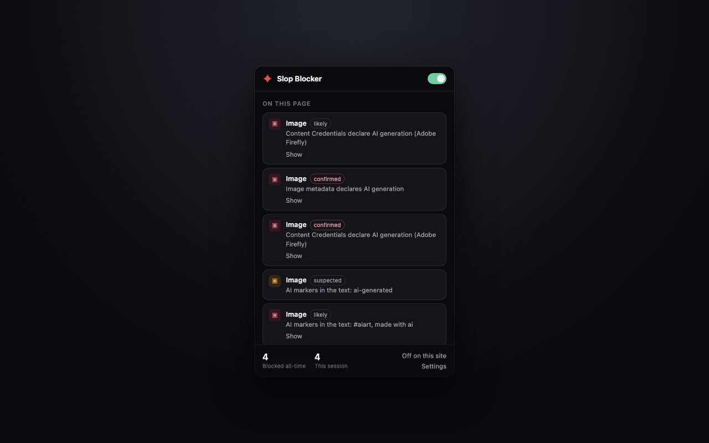
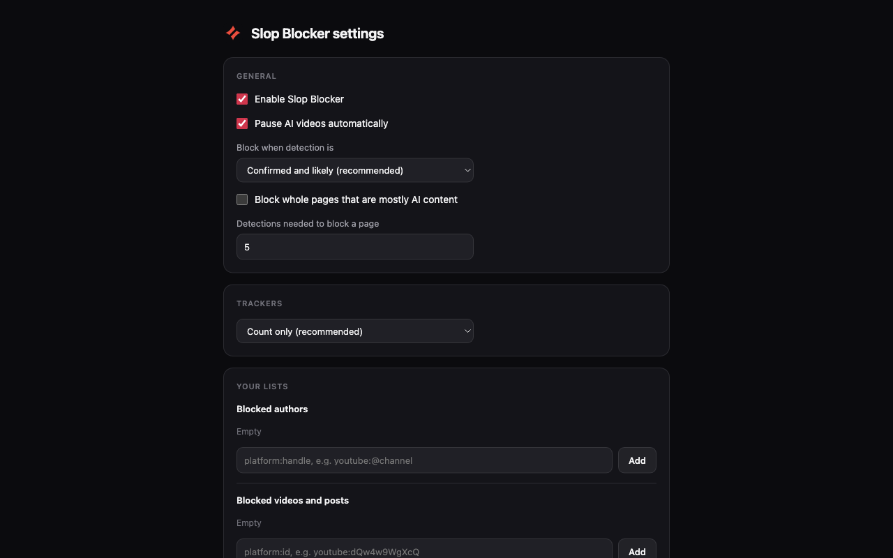

# Slop Blocker

A Chrome extension (Manifest V3) that finds AI-generated content on a page and hides it behind a
click-to-reveal warning. On YouTube it pauses a disclosed video before you watch it. It counts what
it blocked, and what trackers the page loaded.

Implements `SPEC.md`, milestones **M0 + M1**, plus the TikTok / Instagram / X adapters that the spec
scheduled for M2. See [What is not done yet](#what-is-not-done-yet).

[](https://github.com/ddtch/slop-blocker/actions/workflows/ci.yml)
[](LICENSE)


Every block says which signal fired and how sure it is. The essay in the bottom right mentions
"AI-generated" once and gets a chip, not a shroud — see
[the false-positive problem](#the-false-positive-problem-and-what-is-done-about-it).

<p align="center">
  
  
</p>

Screenshots are generated from the built extension in a real browser by `npm run shots` — nothing in
them is mocked up.

---

## How detection works

There is no neural "is this AI?" classifier here, and that is the whole design. Pixel-level
detectors are unreliable and heavy. Instead the extension aggregates signals that already exist:

| Signal | Confidence | Where it comes from |
| --- | --- | --- |
| Platform disclosure | confirmed | YouTube's "altered or synthetic content" label; TikTok's AI-generated badge; Meta's "AI info" tag |
| C2PA Content Credentials | confirmed | A manifest whose created/edited action cites `trainedAlgorithmicMedia` |
| IPTC / XMP metadata | confirmed | `Iptc4xmpExt:DigitalSourceType = trainedAlgorithmicMedia` |
| You marked the author | confirmed | Your own block list |
| Known AI tool signed the file | likely | A C2PA claim generator like Firefly or Midjourney, with no explicit AI action |
| Author on a known-AI list | likely | The creator list |
| Text markers | likely / suspected | Hashtags and disclosure phrases next to the media |

`confirmed` and `likely` are blocked by default. `suspected` only gets a small "possibly AI" chip,
because it is a guess and blocking guesses is how a blocker loses trust.

This works because the platforms did the hard part already: TikTok reads C2PA on upload and labels
AI content whether or not the creator disclosed it, Meta does the same for files exported by
Firefly, Photoshop generative fill, DALL·E and Canva, and YouTube requires creators to disclose
realistic synthetic media.

**Signals do not stack into a higher tier.** Two `suspected` signals stay `suspected` — two weak
guesses are still a guess.

### The false-positive problem, and what is done about it

A video titled *"AI-generated slop is ruining YouTube"* contains exactly the same words as a
disclosure. Two rules keep it from blocking itself:

1. **Disclosure strings are only matched inside disclosure containers** that a site adapter names
   explicitly — never in titles, captions, descriptions or article text.
2. **Keyword tiers are asymmetric.** "Generated with AI" and "#aiart" only get said when someone is
   labelling their own work, so one hit blocks. Bare "AI-generated" is just as likely to be the
   topic, so a single hit stays at `suspected`.

Both rules have tests (`test/unit/disclosure.test.ts`, `test/integration/youtube.test.ts`).

---

## Quick actions

Open the popup on a YouTube channel or video and it offers **Block @thatchannel** and **Block this
video**, which write straight to your personal lists. The button names the account rather than
saying "channel", so it says exactly what it will store. The same works on YouTube Shorts and on
TikTok, Instagram and X profiles and posts.

This runs off the URL and the page chrome, not off detection, so it works on a channel we have no
signal about — which is the point. It also works on a site you switched the extension off on, since
that is exactly when you are most likely to want it. Both buttons are toggles: press again to undo,
or edit the lists in the options page.

Blocking an author covers everything of theirs we can see. Blocking one video is the narrower
decision and wins over trusting its author, so you can trust a channel and still hide one thing on
it. **Caveat, until feed coverage lands:** a blocked video is covered when you open its page, not
when its thumbnail appears in a feed — see [What is not done yet](#what-is-not-done-yet).

---

## Install for development

```bash
npm install
npm run icons        # generate the PNG icons (committed output is optional)
npm run build        # -> dist/
```

Then in Chrome: **chrome://extensions** → enable Developer mode → **Load unpacked** → pick `dist/`.

`npm run watch` rebuilds on change; press the reload button on the extension card to pick changes up.

```bash
npm run check        # typecheck + tests + build, in that order
npm run smoke        # build, then load dist/ into headless Chrome and assert it blocks
npm run shots        # regenerate docs/screenshots/ from the real extension
npm run pack         # build, then write the store zip and print its SHA-256
npm test             # vitest
npm run typecheck    # both tsconfigs
```

`npm run smoke` is the one test that runs the real extension in a real browser, against
`test/fixtures/provenance.html`. It expects exactly five covered items and one chip. It also asserts
that the service worker is actually running, which is the failure no jsdom test can see.

Loading an unpacked extension into headless Chrome needs both paths: `--load-extension` was disabled
in M137 (and fails *silently*, giving you a browser with no extension and a test that reports zero
detections), while the CDP `Extensions.loadUnpacked` that replaced it does not exist on older
Chrome. The script passes both flags, tries the command, and falls back to the flag when the method
is missing.

---

## Architecture

```
content script (every frame, isolated world)
  adapters/<site>   what counts as a media item, where the disclosure and author are
  content/engine    merges signals, decides, drives the overlay, pauses video
  content/shroud    the overlay, in a closed shadow root
  content/observer  when to scan: mutations, scroll, in-page navigation
        │ typed messages (src/proto.ts is the single source of truth)
service worker
  background/registry     per-tab detections, badge, change notification
  background/provenance   fetches media bytes, runs the scanner, caches verdicts
  background/trackers     tracker matching + optional declarativeNetRequest rules
  background/storage      settings, personal lists, counters, bundled lists
        │
popup (live per-tab view)          options page (settings and lists)

main world, YouTube only
  adapters/youtube/main-world   reads ytInitialPlayerResponse, reports a small summary
```

Rules that keep this honest:

- **Content scripts do DOM work; the worker does I/O and state.** Cross-origin media bytes can only
  be read from the worker, and the byte budget is easier to enforce in one place.
- **The worker is disposable.** MV3 can kill it at any moment, so the registry is written through to
  `chrome.storage.session`; the in-memory map is only a cache. The popup never depends on
  worker-lifetime state.
- **Every provider fails open.** A thrown error is logged with a `[slop-blocker]` prefix and skipped.
  A broken adapter must never break the page.
- **Fragile selectors live in one file per adapter** (`adapters/<site>/selectors.ts`) with a
  `LAST_VERIFIED` date and a `NOTES.md` explaining what to re-check. Platform markup churns; this
  makes a breakage a one-file fix.

### Performance budget

- Provenance bytes are read with a `Range: bytes=0-262143` request — metadata sits near the start of
  every container we parse. A full read (capped at 8 MB) happens only when the probe found a manifest
  it could not finish. Video is never fully downloaded.
- At most 3 concurrent fetches; the queue is dropped on navigation; verdicts are cached per URL.
- Only media within two viewport heights is scanned.
- Scans are debounced (250 ms for mutations, 300 ms for scroll) and run in idle time. Detections are
  reported to the worker in batches.

---

## Decisions that differ from SPEC.md

The spec was written before implementation. Four things changed while building it; each is a
deliberate trade, not drift.

**ADR-1: esbuild instead of WXT.** The spec recommended WXT. A ~100-line `build.mjs` does everything
this project needs (five entry points, static copy, a manifest reference check) with five dev
dependencies total and no framework indirection. The cost is no HMR — you press reload on the
extension card.

**ADR-2: a byte-level provenance scanner instead of the `c2pa-web` WASM library.** We need to answer
*"does this file declare it was made by AI"*, not *"is this signature cryptographically valid"*.
That answer is a substring search for `trainedAlgorithmicMedia` and the claim generator, which
removes a WASM dependency, the risk of WASM in an MV3 service worker, and an offscreen-document
fallback. Correctness comes from restricting the search to container metadata: `src/core/provenance.ts`
parses PNG ancillary chunks, JPEG APPn segments, WebP chunks and ISOBMFF boxes, and never looks at
pixel data, so compressed image data cannot produce a coincidental match. Generator names are only
matched in a window after a tool-naming key, so a base64 thumbnail inside XMP cannot fake a match
with a short needle like "veo". **What this gives up:** we do not verify signatures, so a file could
lie about being AI-generated. For a blocking decision that is the right trade — but do not reuse this
module as a trust anchor.

**ADR-3: keyword tiers are `disclosure` / `ambiguous` / `weak`, not `strong` / `weak`.** The spec's
two-tier scoring (strong = 2 points = blocked) would have blocked any video whose title mentioned
"AI-generated", failing the spec's own false-positive test in §11. It would also have *under*-detected
Russian, where "сгенерировано ИИ" is an unambiguous disclosure that scored the same as English prose.
Splitting by linguistic form fixes both.

**ADR-4: overlays are fixed-position and synced, not inserted into an ancestor.** Inserting into the
media's ancestor requires that ancestor to be positioned, which means mutating the page's layout and
guessing at containers that differ per site. A fixed host aligned to `getBoundingClientRect()` never
touches page layout and works everywhere; the cost is a sync pass on scroll, resize and a 500 ms
interval, which is negligible for the handful of overlays a viewport holds. The media element is also
blurred inline as a second layer, in case the page removes our node.

Two smaller corrections found while building:

- `lists/disclosure-strings.json` deliberately omits YouTube's `"Captured with a camera"` value and
  the `"How this content was made"` section heading. Both also appear for content that is **not**
  AI-generated, so matching them would have blocked camera footage.
- Detection keys are de-duplicated per page (`disambiguateKeys`). The same image URL can appear
  several times on one page, and keying only on the URL collapsed those copies so only the first got
  covered.

---

## Verifying the build

Everything this extension claims about itself — no server, no telemetry, metadata reads capped and
sent without credentials — is unverifiable in a minified bundle downloaded from a store. So the
package is built reproducibly and its hash is published with each release:

```bash
git checkout v<version>    # the tag the release was cut from
npm ci && npm run pack     # prints the SHA-256 of slop-blocker-<version>.zip
```

The hash must match the one in that release's notes. `scripts/pack.mjs` sorts entries by path, fixes
every timestamp to the epoch the zip format starts at, zeroes the file modes, and *stores* every
entry rather than compressing it — `zlib.deflate` is not byte-identical across zlib versions, so a
compressed archive would hash differently depending on who built it. The same applies to the PNG
icons, which are written with uncompressed deflate blocks for the same reason. The result is a
larger archive that hashes the same on any machine, which is the only property that matters here.

## Languages

English (default), Spanish and Russian. The UI strings live in `_locales/`, and
`lists/disclosure-strings.json` holds the platform labels per language — those are the ones that
matter for detection, because a disclosure is only found if we know how the platform words it in
that language. `test/unit/locales.test.ts` fails the build if a translation loses a key or a
placeholder.

Adding a language is two files and no code. The disclosure strings are the part that needs someone
who can confirm the wording on a real page; see [`CONTRIBUTING.md`](CONTRIBUTING.md).

## Lists

`lists/` ships four JSON files. Each has a `_readme` explaining its schema and rules.

`lists/creators.json` **ships empty, on purpose.** Calling a named account an "AI slop channel" is a
factual claim about a real person, and shipping unverified names would be defamatory and would
produce false positives users cannot audit. You build that list yourself: right-click → *Slop
Blocker: block this author*, the button on the overlay, or the options page. A curated community list
can come later behind the opt-in list-updates setting.

`lists/trackers.json` is a hand-curated set of well-known analytics and ad-tech hostnames — not a
redistribution of a blocklist. To broaden it, extract domains from a licence-compatible public source
and record the source and licence in the file header.

---

## Privacy

All detection is local. There is no analytics, no telemetry and no server. The only network requests
the extension makes are reads of media the page already loaded, sent with `credentials: "omit"`, to
look at their metadata. See `PRIVACY.md`.

Tracker **counting** is observational (Resource Timing). Tracker **blocking** is opt-in. In blocking
mode the blocked requests never reach the page and so are not counted — counting them would need the
`declarativeNetRequestFeedback` permission, whose "read your browsing history" install warning is not
worth a counter. The popup therefore says *found*, not *blocked*.

---

## What is not done yet

Ordered by how much it matters.

1. **No selector has been verified against a live page.** Every adapter was written from public
   documentation. The YouTube player-response field names in particular are searched generically by
   key name rather than pinned, precisely because they are unverified. Work through `TESTING.md`
   before trusting any of it, then set `LAST_VERIFIED` and
   `lists/disclosure-strings.json` → `_meta.lastVerified`.
2. **The real-browser test only covers the generic path.** `npm run smoke` loads the built extension
   into Chrome and verifies provenance detection, keyword tiering and the overlay on a local page —
   but no automated test visits a platform. The YouTube pause path is covered in jsdom only, because
   asserting it for real means depending on a third-party video that carries the disclosure.
3. **The generic adapter only reads text from `alt`, `title`, `aria-label` and `<figcaption>`.**
   On a page whose captions live in sibling `<div>`s — which is most of the web — the keyword
   signal never fires at all, so an undisclosed-but-hashtagged image is only caught if it also
   carries provenance metadata. Widening this without dragging in unrelated page text is the open
   design question; see `nearbyText()` in `src/adapters/generic.ts`.
4. **Feed thumbnails are not candidates**, so a blocked video or author is only covered on the
   item's own page, not where its card appears in a feed or in search results. This is the same gap
   as the YouTube feed badging below, and it is what limits the quick actions.
5. **Facebook** is not implemented (it shares Meta's label but not the markup). **YouTube feed and
   channel pages** are not badged. **Instagram stories** are not covered.
6. **TikTok's page JSON** (`__UNIVERSAL_DATA_FOR_REHYDRATION__`) is unread; a main-world script like
   YouTube's would give a pre-render signal that survives badge markup changes.
7. **No remote list updates** (`settings.listUpdates` is forced to `false`), no notifications, no
   Firefox build, no CSS background images, no MP4 provenance probing.

---

## Where this is going

- [`docs/competitive-analysis.md`](docs/competitive-analysis.md) — what the other twelve extensions
  in this category do, what their one-star reviews say, and what is worth taking from each.
- [`docs/roadmap.md`](docs/roadmap.md) — the plan that came out of it, and the anti-goals.
- [`SPEC.md`](SPEC.md) — the original specification. Where it and the roadmap disagree, the roadmap wins.

## Contributing

The most useful contribution is a false-positive report: something we covered that we should not
have. Selector fixes and disclosure strings for languages we do not speak are the next two. See
[`CONTRIBUTING.md`](CONTRIBUTING.md), which also lists the rules that are not up for negotiation —
among them that `lists/creators.json` stays empty and that we publish no accuracy percentage.

Security issues: [`SECURITY.md`](SECURITY.md). Report privately.

## Licence

MIT. See [`LICENSE`](LICENSE).
